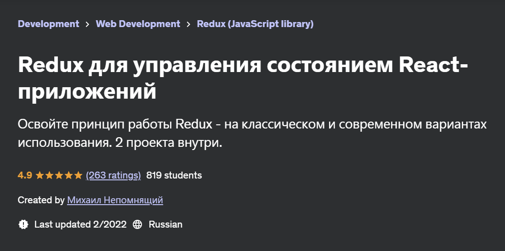

# Redux for managing state in React applications

Hi!

In this repo I store notes from the course of [Redux for managing state in React applications](https://www.udemy.com/course/redux-react/) by Mikhail Nepomniashchii

